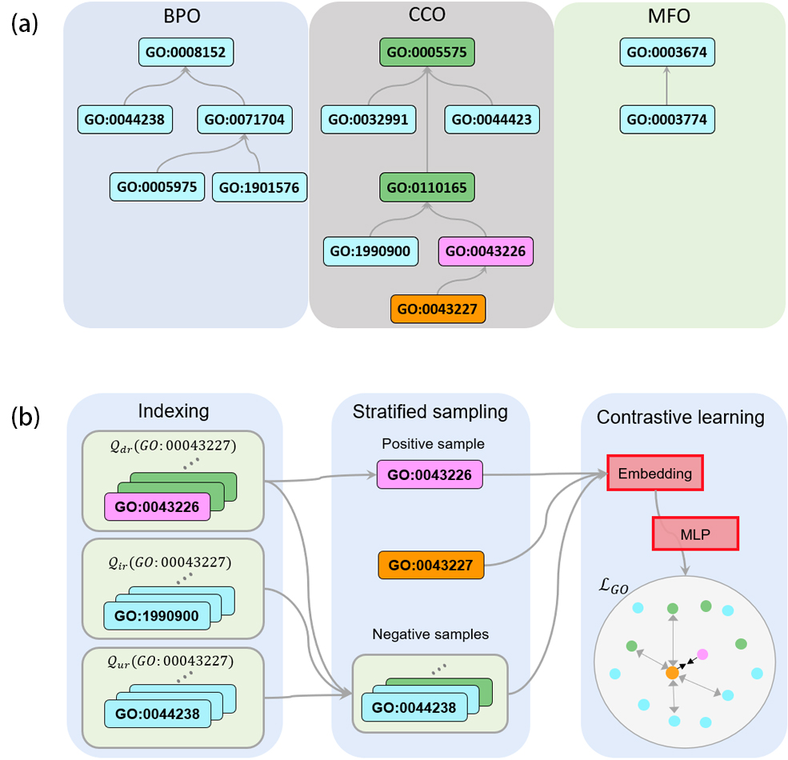
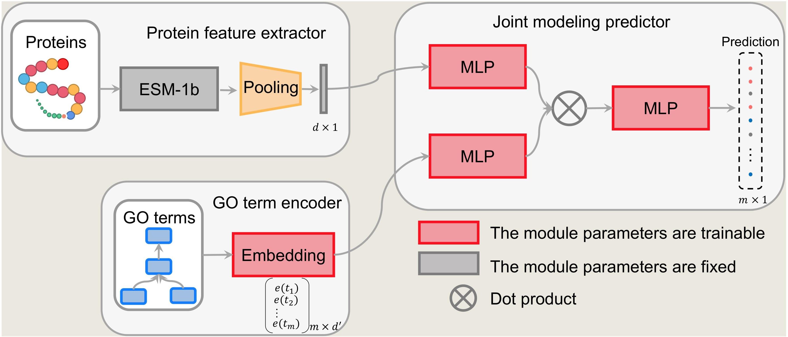

# PO2Vec: partial order relation-based gene ontology embedding improves protein function prediction

PO2Vec is a novel method for GO term representation learning. Compared with existing methods based on GO DAG structure, PO2Vec captures the topological information of GO more comprehensively under in-path partial order constraint and out-path partial order constraint. The effectiveness of PO2Vec was demonstrated in experimental
analyses from five aspects.



PO2GO is a two-step protein function annotation prediction model, which is jointly constructed by PO2Vec and the protein language pre-trained model ESM-1b. The superior performance of PO2GO is demonstrated with comparative benchmarks.



This repository contains script which were used to build and train the PO2Vec and PO2GO model.


## Installation

### Dependencies
* The code was developed and tested using python 3.9.
* All the dependencies are listed in `requirements.txt` file.

### Install from github
The source code for PO2Vec and PO2GO can be obtained from the official GitHub repository.

To clone the repository, use the following command:

```bash
# clone project
git clone https://github.com/xbiome/protein-annotation
# install dependencies
pip install -r requirements.txt
```

Alternatively, you can manually install the necessary dependencies, such as `torch` via `pip`.
```bash
pip install torch
```

Once you have a copy of the source code, install it with:

```bash
python setup.py install
```

## Explanation of files and folders

### Folders
| name  | description | file type | 
|:--------|:---|--------:|
| `figs`    | folder contain figures from the paper| `.jpg` file|
| `data`    | Folder containing PO2Vec embeddings, protein sequences, label files for model training, and `go.obo` file|'.pkl' file|
| `po2go`   | Core code for **PO2GO** and **PO2Vec** algorithms| `.py` files|
| `po2go/po2vec`   | Scripts for the **PO2Vec** contrastive learning algorithm for GO embedding| `.py` files|
| `po2go/po2go`    | Protein function prediction codes for **PO2GO**| `.py` files|
| `po2go/po2go/utils`    | Utility functions for PO2GO and PO2Vec| `.py `files|
| `preprocess_raw_data.py`    | Converts UniProt data to a Pandas DataFrame| `.py `file|
| `prepare_data_seperate_swissprot.py`    | Separates UniProt-SwissProt data into training and test sets| `.py` file|
| `prepare_data_seperate_ontologies.py`    | Separates training (or test) data into groups based on annotation ontologies| `.py` file|


### Files for the paper
| name  | description | file type | 
|:--------|:---|--------:|
| `evaluate_*.py`    | Scripts to compute Fmax, Smin, and AUPR for evaluating protein function prediction| `.py` file|
| get_protein_embedding.py    | Generates protein embeddings using the ESM-1b model| `.py` file|
| `train_po2go.py`    | Trains the PO2GO model for protein function prediction. Each domain (MFO, BPO, CCO) has an independent model. If `--namespace == annotated`, all three domains are used in a single model| `.py` file|
| `inference_po2go.py`    | Infers test data to generate prediction files. Each domain (MFO, BPO, CCO) has an independent model| `.py` file|
The corresponding data files can be accessed from [here](https://drive.google.com/drive/folders/1uRrwF7eTcJicOpfIIz9mapUkkTt5vYve?usp=sharing).


### Files for inference protein GO terms

To use the PO2GO algorithm for more accurate protein function prediction, a model was trained with all annotated proteins from UniProt-SwissProt (approximately 500,000 proteins). The saved model weights and the associated `go.obo` and `terms_annotated_embeddings.pkl` files can be accessed from [here](https://drive.google.com/drive/folders/1P4ExHz0iFCXq5kwRqmAG8XXNZAvoQcX5?usp=sharing).

| name  | description | file type | 
|:--------|:---|--------:|
| `inference_fasta.py`    | Inference script for GO terms using protein sequences in FASTA format. Outputs a CSV table. Requires model weights, `go.obo`, and `terms_annotated_embeddings.pkl`| '.py' file|
| `inference_fasta_cpu.py`    | CPU-based version of inference_fasta.py for users without GPU access| '.py' file|


## Commond line usage
The scripts require GeneOntology in OBO Format.
* preprocess_raw_data.py - This script is used to convert data from UniProt database format to pandas dataframe.
* prepare_data_seperate_swissprot.py - This script is used to seperate data from UniProt-Swissprot into train and test dataset.
* prepare_data_seperate_ontologies.py - This script is used to seperate train(test) data into three groups based on annotation ontologies.
* po2go/po2vec - This folder is used to train PO2Vec model to get terms embeddings.
* train_po2go.py - This script is used to train the model.
- to train a model predict mfo terms run sh: 
```bash
python train_po2go.py --namespace mfo -ld 512 -p 768
```
- to train a model predict bpo terms run sh:
```bash
python train_po2go.py --namespace bpo -ld 768 -p 1280
```
- to train a model predict cco terms run sh:
```bash
python train_po2go.py --namespace cco -ld 512 -p 896
```
- to train a model predict annotated terms run sh:
```bash
python train_po2go.py --namespace annotated -ld 768 -p 1280
```
* inference_po2go.py - This script is used to inference test data to get prediction file.
* evaluate_*.py - The scripts are used to compute Fmax, Smin and AUPR.
### 

* inference_fasta.py -This script is used to inference fasta format data by annotated model.
```bash
python inference_fasta.py -i input.fasta -o output.csv -b batchsize
```
```bash
python inference_fasta_cpu.py -i input.fasta -o output.csv -b batchsize -T number_cpucore
```

## Citation

If you use PO2Vec for your research, or incorporate our learning algorithms in your work, please cite:

```
@article{li2024partial,
  title={Partial order relation--based gene ontology embedding improves protein function prediction},
  author={Li, Wenjing and Wang, Bin and Dai, Jin and Kou, Yan and Chen, Xiaojun and Pan, Yi and Hu, Shuangwei and Xu, Zhenjiang Zech},
  journal={Briefings in Bioinformatics},
  volume={25},
  number={2},
  pages={bbae077},
  year={2024},
  publisher={Oxford University Press}
}
```

## New version specifications
Current dependencies can be found in the requirements.txt file.
The used Python version is 3.9.12.
